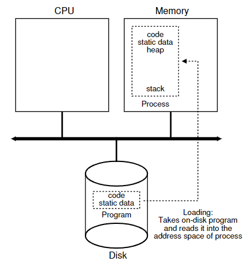

# 4장. 프로세스의 개념

* [개요](#개요)
* [프로세스의_개념](#프로세스의_개념)
* [프로세스_API](#프로세스_API)
* [프로세스_생성](#프로세스_생성)
* [프로세스_상태](#프로세스_상태)
* [자료구조](#자료구조)
* [요약](#요약)


[뒤로](https://github.com/kkbp1021/OS-Study)

</br>

## 개요

운영체제 과정의 가장 처음 과정은 프로세스(process)로 시작한다. 컴퓨터의 모든 것은 프로세스로 이루어졌다고 할 수 있을 정도로, 프로세스는 CS를 배우기 시작과 끝에 있는 아주 중요한 개념이다. 프로세스는 실행 중인 `프로그램` 이다. 프로그램은 하드 디스크(혹은 낸드 플래시)에 저장된 정적인 데이터 덩어리를 말하며, 이들에게 일련의 신호를 거쳐 프로세스로 만드는 작업을 운영체제가 수행하는 것이다.

다만 우리는 항상 효율적으로 시스템을 운영하고 싶다. 웹 브라우저로 아침 기사를 읽으면서, 유투브로 음악을 재생하고, 카카오톡으로 친구와 메세지를 주고 받고 싶다. 이런 기능들은 하나의 컴퓨터에서 모든 것이 이루어져야 하며, 그럴려면 여러 개의 프로세스를 하나의 PC가 수행해야 한다. 

자 입장을 바꿔서 내가 프로세스라고 생각을 해보자. 프로세스는 CPU를 사용하여 내가 가지고 있는 코드들을 실행해야 한다. 예를 들어... 1초에 10000개 정도의 명령어를 수행하는 프로세스라고 가정하자. 만약 CPU가 1초에 10000000개의 명령어를 수행할 수 있다면? 이럴 땐 천분의 일만큼만 내가 CPU를 사용하고, 다른 프로세스들은 사용해도 난 내가 해야할 일들을 충분히 해낼 수 있다. 이 방법을 시분할(time sharing) 이라고 하며 다른 말로는 마치 프로세스들은 여러 개의 CPU가 있다고 생각해 `가상화` 라고도 한다. 운영체제에서 가상화는 매우 중요한 개념인데, 지금부터 어떻게 가상화를 이루는 알아보자.

## 프로세스의_개념

프로세스를 구성하는 요소들을 이해하기 위해서는 하드웨어 상태에 대해 알 필요가 있다. 우선 `메모리`를 들 수 있다. 메모리는 디스크에 저장된 정적 데이터가 실행 기간동안 적재되는 곳이다. 이 공간에 프로세스는 Stack, Heap, Data, Code 공간을 가지는 것이다. `레지스터`도 중요한 하드웨어 상태 구성 요소다. 이중 PC(Program Counter)와 SP(Stack Pointer)가 특히 중요한데 PC는 다음 실행될 명령어의 주소를 가지고 있고 SP는 프로세스의 Stack의 최상단 주소를 저장하고 있다. 


> **Note:** SP는 다음 스택의 주소를 가리키고 있어 새로운 변수의 값을 저장해야하면 SP를 불러온 다음에 해당 주소에 이어서 쓴다. 스택에는 함수의 리턴 주소, 로컬 변수등이 저장되는데, FP(Frame Pointer)는 함수가 stack에 쓰기 시작한 주소를 저장한다. 만약 함수가 호출이 끝났다면 FP를 호출해서 기존의 스택들을 덮어 씌우는 방식이다.

## 프로세스_API

프로세스를 위해 운영체제에서 제공하는 기능은 다음과 같다. 

* Create: 프로세스를 생성하는 방법은 크게 2가지로 나눌 수 있다. fork와 exec. 해당 방법에 대해서는 뒷 장에서 깊게 이야기 해보자.
* Destory: 당연하지만 강제로 제거하는 방법도 운영체제가 지원해야 한다. 대부분의 프로세스들이 할 일을 다 했다면, 알아서 종료하지만, 종종 그렇지 않는 경우가 있어서(다양한 이유가 있을 수 있다. 예정된 IO 입력이 없으면 timeout하는 경우도 예시다) 강제로 종료해야한다.
* Wait: 이런 경우는 보통 다른 프로세스 혹은 입출력에 종속적인 경우다. 남에게 필요한 것이 있으니 기다린다 라고 생각하면 된다
* Miscellaneous Control: 책에서는 위 3개 이외의 잡다한 기능이라고 명시되어있다. 챗 GPT에 따르면 우선순위 조정, 프로세스 ID 조회, 자원 사용량 조회등이 이에 포함된다고 할 수 있다.

## 프로세스_생성

그럼 어떻게 컴퓨터는, 정적 데이터에 불가한 디스크내의 **프로그램**을 프로세스로 변신시키는 것인가? 
아래의 사진을 확인해보면 디스크내의 정적 데이터들이, 버스를 통해 메모리에 적재된다. 운영체제는 이 데이터가 메모리의 **어디에** 저장될 지를 정한다. 

초기의 운영체제들은 프로세스를 실행하는 것은, 프로그램의 모든 데이터들을 메모리에 올리는 것과 동일했다. 하지만 현대의 컴퓨터는 필수적인 데이터만 올린 다음, 필요시에 디스크에 방문한다. 이런 딜레이된 동작을 위해서는 **페이징**과 **스와핑**에 대해 알아야한다.

프로세스는 단순히 메모리에 올라가는 것이 아닌, 용도에 따라 사용하는 구역이 달라진다. 지역 변수, 리턴 주소, 함수 인자등이 저장되는 Stack. 일단 프로세스가 생성되면 미리 설정된 값에 따라 스택이 초기환된다. 그리고 동적인 공간인 Heap. 스택은 이미 크기가 지정된 변수들이면, heap은 유동적으로 크기를 변화할 수 있다. 그리고 프로그램의 오브젝트 파일이 저장되는 Code와 전역 변수와 같은 데이터가 저장되는 Data 파트로 나누어진다. 여기서 값이 지정되나 안되나에 따라 Data 혹은 BSS 영역으로 나누게 된다. 


<div style="text-align: center;">

</div>

>**Note:** 페이징은 메모리를 쪼개서 사용하는 방법으로 메모리가 할당되고, 해제되는 작업이 반복해 사용하기 어려운 메모리 공간이 생기는 문제인 **외부 단편화**를 해결한 방법이다. 페이지들은 운영체제 상에서는 연속되게 나타내지만 실제로는 불연속적인 구조를 가지고, 이 둘간의 사이를 **페이지 테이블**을 통해 계산해내는 것이다. 여기서 페이지는 가상 메모리의 조각이고, 프레임은 실제 메모리의 조각이다.
스와핑은 디스크상의 일부분을 메모리 공간처럼 사용하는 기능이다. 프로세스 전체를 이동시키며 사용이 적으면 디스크에 내려보낸다(swap out). 반대도 성립(swap out).

`참고로 TLB는 페이지 테이블의 캐시라고 생각하면 된다.`

## 프로세스_상태

프로세스 상태는 다음과 같다
1. Running: 현재 실행중인 프로세스를 의미. 당연하지만 하나의 코어당 하나만 실행된다.
2. Ready: 준비된 상태. 바로 실행할 수 있지만 현재 다른 프로세스가 실행중이라 대기중.
3. Blocked: 중단. 예를 들어 다른 입출력을 기다리는 경우 일시적으로 중단된다.
4. Zombie: 죽은 상태. 프로세스가 끝나면 바로 삭제되지는 않고 zombie 상태로 전이된 뒤 없어지는 경우도 있다.

위 상태들이 유기적으로 작용하여 CPU를 점유했다 안했다 한다.

## 자료구조

1. Process List: 프로세스들을 저장하는 자료 구조. 운영체제마다 명칭이 다른데 리눅스에서 ps 명령어를 사용했을 때 리스트되는 아이템들은, process list 라는 자료 구조를 호출한다 생각하면 된다. 보통은 해당 프로세스의 pid들을 저장하고 process 자료 구조를 통해 상태 정보를 호출하는 듯 하다.
2. Register Context: 지금 실행하고 있는 프로세스의 레지스터들을 저장해둠. 이 값을 복원해서 다른 프로세스로 넘어가는 것이다. 해당 작업을 Contect Switch라고 함.

## 요약

```
전반적인 프로세스의 개념을 다룬다. 프로세스를 잘 알아야지 가상화를 사용해서 우리 귀한 컴퓨터를 아주 효율적으로 사용할 수 있을 것이다.
```