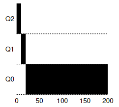
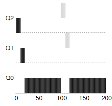
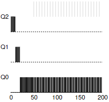

# 8장. 스케줄링: 멀티 레벨 피드백 큐 MLFQ

* [개요](#개요)
* [MLFQ_기본규칙](#MLFQ_기본규칙)
* [MLFQ_우선순위_변경](#MLFQ_우선순위_변경)
* [MLFQ_우선순위_상향](#MLFQ_우선순위_상향)
* [MLFQ_특정작업_점유방지](#MLFQ_특정작업_점유방지)
* [기타등등](#기타등등)
* [요약](#요약)


[뒤로](https://github.com/kkbp1021/OS-Study)

</br>

## 개요

앞선 스케줄링 알고리즘인 STCF, RR의 장점만을 채용한 알고리즘
또한 기존의 가정이었던 모든 프로세스의 실행시간을 알고있다 를 없앤 현대 운영체제 스케줄링 알고리즘의 시초이다
MLFQ가 해결할려고 한 문제는 다음과 같다
1. 짧은 작업을 우선적으로 끝내 반환 시간을 최소화한다
2. 최대한 짧은 응답 시간을 제공한다

1번의 경우 SJF, STCF 같은 스케줄링 알고리즘을 사용하면 최대한 빨리 끝낼 수 있지만, 응답 시간이 최악이다.
하지만 좋은 응답시간을 가진 RR은 최악의 반환 시간을 가질 수 있다.
또한 실행 시간에 대한 정보 없이 스케줄러는 어떻게 프로세스들을 배치할 수 있을까?

## MLFQ_기본규칙

여러 개의 큐 + 각각 서로 다른 우선순위
프로세스는 이 중 하나의 큐에 속하게 된다.
큐에는 둘 이상의 프로세스가 존재할 수 있고, 이때는(즉 우선순위가 같은 프로세스들) 프로세스들이 RR로 스케줄링 된다. 
MLFQ의 핵심은 우선순위를 정하는 방식이다. 각 프로세스들은 고정된 우선순위를 가지는 것이 아니라, 각 프로세스들의 상태에 따라 동적으로 부여된다. 예를 들어 입출력을 기다리고 있어 반복적으로 CPU를 얻었다 잃은 경우라면, 우선 순위가 높을 것이다. 하지만 프로세스가 CPU를 오래동안 점유한 상태라면 우선순위가 낮아질 것이다.
정리하면 MLFQ의 기본 규칙은 다음과 같다.

1. 프로세스 A의 우선 순위 > 프로세스 B의 우선 순위 이면, A가 실행된다
2. 프로세스 A의 우선 순위 = 프로세스 B의 우선 순위 이면, A와 B가 RR로 동작


## MLFQ_우선순위_변경

동적으로 우선순위를 변경할 때의 룰을 정해야 한다.
이때는 사용하는 시스템의 특성을 고려해야 하는데 예시를 들어 실행 시간이 짧고 응답 시간이 중요한 대화형 작업들과, 긴 실행 시간을 가지는 작업들이 혼재되어 있는 시스템을 고려해보자.

#### 예시 1: 한 개의 긴 실행 시간을 가지는 작업의 경우
처음에 작업이 들어 오면, 일단 가장 높은 우선 순위를 배정한다. 하나의 타임 슬라이스를 소모할 때마다 우선 순위가 내려가서, 최종적으로 제일 낮은 우선 순위를 계속 가진다
<div style="text-align: center;">

</div>

#### 예시 2: 짧은 실행 시간의 작업이 들어 오는 경우
100ms에 작업 하나가 추가되는 경우를 가정하자. 일단 응답 시간을 개선하기 위해 들어오는 작업은 짧은 실행 시간을 가진다고 생각해 가장 높은 우선순위 큐에 배정한다. 타임 슬라이스를 소모함에 따라 우선 순위를 낮추면서 최종적으로 가장 낮은 우선순위 큐까지 떨어진다. 이 방식을 통해 MLFQ는 SJF의 장점을 가져올 수 있다.
<div style="text-align: center;">

</div>

#### 예시 3: 입출력이 있는 경우
중간에 들어온 작업이 1ms만 사용하고, 입출력을 기다리는 경우이다. 이때 작업은 CPU를 계속 점유하고 있는 것이 아니고, 외부의 입출력을 요청하고 다른 작업에게 CPU를 넘겨준다. 이런 경우에는 우선 순위를 낮추지 않고 그대로 둔 다음, 인터럽트가 들어오는 경우 ready 상태의 작업을 다시 실행하는 것이다. 이 방식은 시스템이 대화형 시스템일 경우, 빠르게 응답한다는 장점이 있다.
<div style="text-align: center;">

</div>

여기까지의 예시들을 룰로 정리하면

3. 작업이 시스템에 진입하면, 가장 높은 우선순위 큐에 배정한다.
4-a. 주어진 타임 슬라이스를 모두 소모하면, 우선 순위가 하나 내려간다
4-b. 다 소모하기 전에 CPU를 반환하면, 해당 큐에 머문다.


#### MLFQ의 문제점?
예시 3까지의 스케줄링 알고리즘을 적용하면, 몇몇 문제점이 있다.
1. 일단 기아 상태`starvation`가 발생할 수 있다. 시스템에 너무 많은 대화형 작업(짧은 시간에 입출력을 요구)이 있는 경우 우선 순위가 낮은 긴 실행 시간 작업들은 자원을 할당받지 못한다.
2. 해커들이 이를 악용해서 특정 프로세스만 동작하게 할 수 있다. 예를 들어 적절한 시간에 입출력을 요구하여 가장 높은 우선 순위 큐에 내 작업만 존재하게 하는 것이다.
3. 또 시간에 따라 작업의 특성이 바뀔 수 있다. 처음에는 대화형이 아닌데 나중에 대화형이 된 경우, 다른 작업(대화형등)들과 동일한 대우를 받지 못한다.

## MLFQ_우선순위_상향

룰을 보완해서 기아 현상을 피해보자. 긴 실행 시간을 가지는 작업들이 어떻게 하면 조금이라도 작업 시간을 보장받을 수 있을까?
간단한 아이디어로 주기적으로 모든 작업의 우선순위를 **상향**하는 것이다.

5. 일정 시간이 지나면, 모든 작업들을 최상위 큐로 이동시킨다.

룰 5는 두 가지 문제를 모두 해결한다. 하나는 기아 현상을 해결하는 것이고, 둘은 CPU 위주의 작업이 대화형 작업으로 변한 경우 변경된 특성이 스케줄러에 반영될 수 있다는 점이다.

## MLFQ_특정작업_점유방지

해결해야하는 문제는 하나 더 있다. 스케줄러를 자신에게 유리하게 동작시키는 것을 어떻게 막을 수 있을까? 이러한 현상은 4-a, 4-b에 의해 일어난다. 여기서의 해결책은 각 작업의 CPU 점유 시간을 측정하는 것.
프로세스가 타임 슬라이스에 해당하는 시간을 큐에서 다 사용했다면, 하나 낮은 우선 순위 큐로 이동 시키는 것이다.
룰 4를 재정의시

4. 주어진 단계에서 주어진 시간을 모두 소모하면, 우선 순위는 낮아진다.


## 기타등등

아직 모든 쟁점들을 해결한 것은 아니다. 예를 들어 필요한 큐의 수. 큐당 타임 슬라이스의 길이. 얼마나 자주 우선 순위가 상향되어야 하는가? 등이다. 이런 점들은 운영체제마다 다르며 적절화 최적화가 적용된다.
대부분의 MLFQ는 큐마다 타임 슬라이스의 길이가 다르다. 높은 건 타임 슬라이스 길이가 짧고, 낮은건 길다. 대체로 높은 것은 대화형으로 이루어지고, 낮은 것은 CPU 중심의 작업이다. 


## 요약

```
MLFQ는 작업에 대한 사전 정보 없이, 우선 순위를 부여하고, 작업의 동작에 따라 우선 순위를 다시 지정한다. 반환 시간과 응답 시간을 둘 다 최적화함에 있어 SJF, STCF와 RR의 장점들을 혼재한 스케줄링 알고리즘이다.
```

